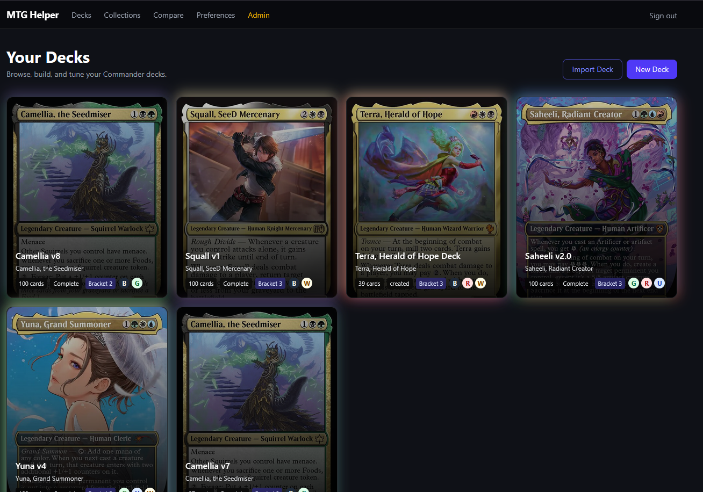
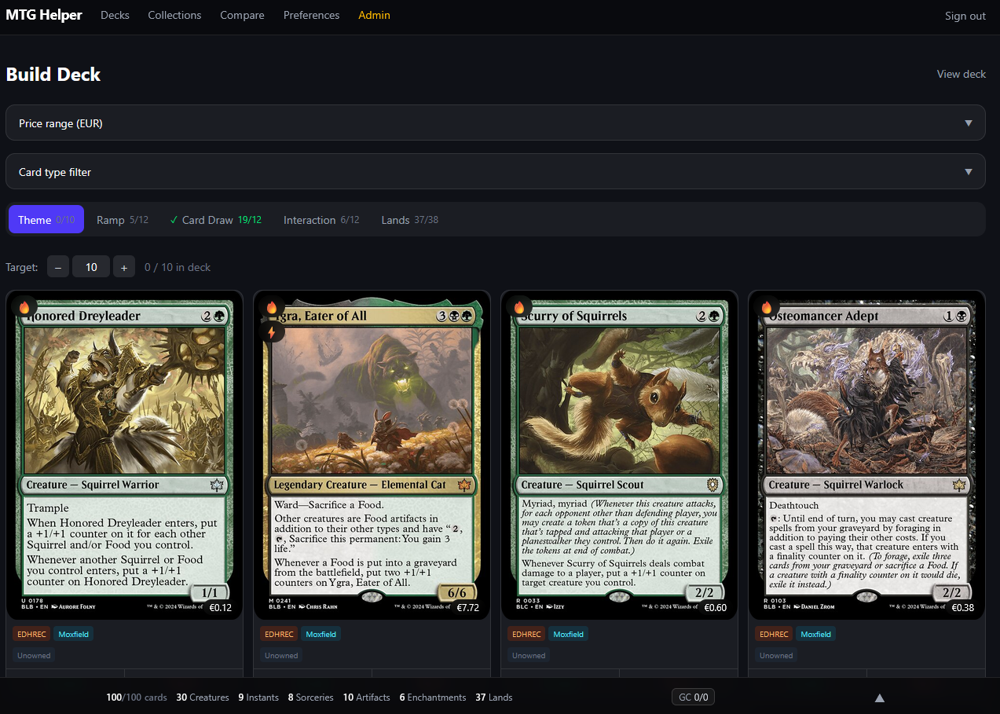
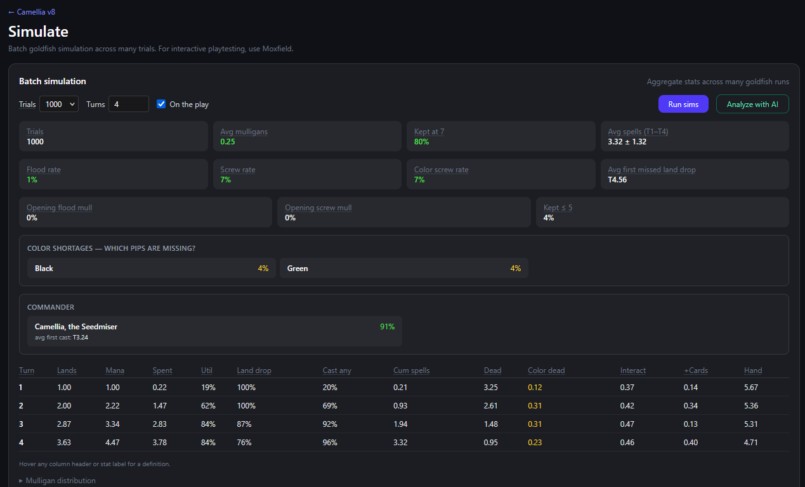

# MTG Helper

AI-assisted Commander deck building for Magic: The Gathering.

**Live app:** [https://mtg.marioweid.com](https://mtg.marioweid.com)  
_Requires Cloudflare whitelist access._

MTG Helper helps Commander players turn a deck idea into a playable list. Pick a commander, describe the strategy you want in natural language, search and add cards, refine the list with AI assistance, account for cards you already own, create Cardmarket buy lists for missing cards, and test opening hands and early turns with the built-in goldfishing tools.

## Screenshots

### Home / deck workspace



### Deck builder



### Goldfishing



## What it does

MTG Helper is built around one goal: make Commander deck building faster without removing the creative decisions from the player.

Instead of manually searching through thousands of cards, you can describe what you want the deck to do — for example, a token-copy strategy, a graveyard engine, a spellslinger shell, or a specific casual power bracket — and use the app to assemble, inspect, improve, and playtest the list.

The application combines a local Scryfall-backed card database, deck management workflows, AI-assisted recommendations, and Commander-specific tooling.

## Features

- **Commander-focused deck building** — Create and manage Commander decks with categories, card counts, commander sections, and legality-aware card data.
- **AI card coach** — Ask for card suggestions, swaps, strategy feedback, and improvements based on the deck you are building.
- **Natural-language deck direction** — Describe the deck's theme, plan, constraints, and preferred play experience.
- **Card search and details** — Search the local card database and inspect card images, rules text, color identity, mana value, and other metadata.
- **Deck refinement tools** — Review suggestions, compare changes, manage swaps, and keep the deck moving toward a coherent plan.
- **Goldfishing / playtesting** — Draw hands and simulate early turns to check whether the deck actually functions.
- **Mana and curve insights** — Inspect mana curve, color requirements, land balance, and deck composition.
- **Card collections** — Track owned cards so the app knows what is already available in your collection.
- **Collection-aware deck building** — Build and refine decks with ownership information in mind, including whether suggested cards are already owned.
- **Cardmarket buy lists** — Generate a buy list for missing deck cards that are not currently in your collection.
- **Moxfield-oriented workflows** — Import, export, and work with deck lists from existing Magic deck-building tools.
- **Fresh card data** — Scryfall bulk data is imported into PostgreSQL so card search and validation work locally.

## Tech stack

- **Frontend:** Next.js, React, TypeScript
- **Backend:** Python 3.13, FastAPI, Pydantic, asyncpg
- **Database:** PostgreSQL 16
- **Vector search:** Qdrant
- **AI:** OpenAI Responses API / Pydantic AI integration
- **Local development:** Docker Compose
- **Deployment:** Portainer-friendly Docker Compose stack behind a reverse proxy / Cloudflare access layer

## Local development

The easiest way to run the full stack is Docker Compose.

```bash
# Copy the backend environment file used by local Compose (it remains outside images).
cp backend/.env.example backend/.env
$EDITOR backend/.env  # set OPENAI_API_KEY

# start Postgres, backend, and frontend
docker compose up -d --build

# follow logs
docker compose logs -f backend frontend
```

Default local services:

| Service | URL |
|---|---|
| Frontend | http://localhost:3000 |
| Backend API | http://localhost:8000 |
| PostgreSQL | localhost:5432 |

Stop the stack with:

```bash
docker compose down
```

See [`OPERATIONS.md`](OPERATIONS.md) for production deployment, data sync, Portainer setup, and operational commands.

## Development checks

Backend:

```bash
cd backend
uv run ruff check .
uv run ruff format --check .
uv run ty check src/
uv run pytest -q
```

Frontend:

```bash
cd frontend
pnpm install
pnpm typecheck
pnpm build
```

## Project documentation

More detailed design notes live in [`projects/mtg-helper`](projects/mtg-helper):

- [Overview](projects/mtg-helper/overview.md)
- [Architecture](projects/mtg-helper/architecture.md)
- [API design](projects/mtg-helper/api-design.md)
- [Data model](projects/mtg-helper/data-model.md)
- [Workflows](projects/mtg-helper/workflows.md)
- [Roadmap](projects/mtg-helper/roadmap.md)
- [Tech stack](projects/mtg-helper/tech-stack.md)

## Status

This is an active personal project. The public URL is protected and only available to whitelisted users through Cloudflare access controls.
